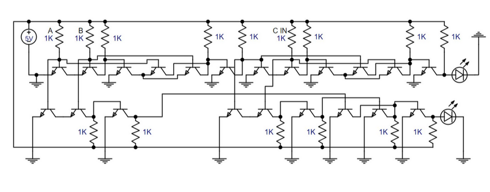

# Full Adder Using Transistors

This project implements a full adder circuit using transistors. A full adder is a digital circuit that performs addition of three binary bits, producing a sum and a carry output. The three inputs are typically labeled as A, B, and Cin (carry-in), and the two outputs are Sum and Cout (carry-out).

## Components
- **Transistors**: Used as the basic building blocks to create the logic gates required for the full adder.
- **Resistors**: Used to control the current flow through the transistors.
- **Power Supply**: Provides the necessary voltage for the circuit.

## Circuit Design
The full adder is constructed using a combination of logic gates:
1. **XOR Gate**: Used to compute the sum of the input bits.
2. **AND Gate**: Used to compute the carry-out from the input bits.
3. **OR Gate**: Combines the carry outputs from the AND gates.

## How It Works
1. The XOR gate computes the sum of A and B.
2. Another XOR gate computes the sum of the previous sum and Cin.
3. The AND gates compute the carry-out from A and B, and from the previous sum and Cin.
4. The OR gate combines the carry outputs to produce the final carry-out.

## Applications
Full adders are fundamental components in arithmetic logic units (ALUs) and are used in various digital systems for performing binary addition.

## Schematic

## Simulation
The circuit can be simulated using software tools like SPICE to verify its functionality before physical implementation.

## Conclusion
This project demonstrates the construction of a full adder using basic transistor-level components, showcasing the principles of digital logic design.